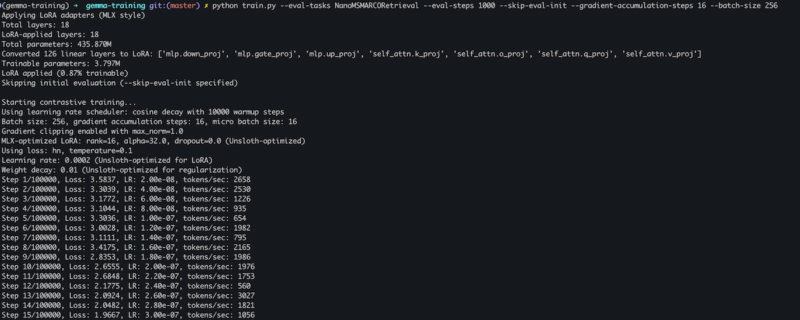

# mlx-retrieval

Train embedding and reranker models for retrieval tasks on Apple Silicon with MLX. Features:

- Full/partial LoRA training with MLX only
- InfoNCE, NT-Xent loss with hard negative mining
- Gradient accumulation for large batch sizes
- MLX Data for efficient data loading
- MTEB integration for evaluation, W&B integration for logging

On M3 Ultra 512GB (80 GPU cores), training speed of `gemma-3-270m` is around 4000-5000 tokens/sec using an effective batch size of 256 and 16 gradient accumulation steps.

## File Structure

- `train.py` - The LoRA training script
- `eval.py` - MTEB evaluation used during training; can also be used standalone
- `embed.py` - Helper functions for generating embeddings
- `loss.py` - Loss functions
- `data_loader.py` - Efficient data loader that streams training data from local JSONL files or Elasticsearch indices
- `train-data.jsonl` - Sample training data in JSONL format. This contains synthetic data for testing purposes.
- `gemma-3-270m-mlx` - The [`gemma-3-270m`](https://huggingface.co/google/gemma-3-270m) model converted to MLX format. You can also convert it yourself using `mlx_lm.convert --hf-path unsloth/gemma-3-270m --mlx-path gemma-3-270m-mlx`. Note that `gemma-3-270m` is licensed under https://ai.google.dev/gemma/terms 

## Getting Started

To use the pre-converted MLX `gemma-3-270m` example model:

```bash
git lfs install
git clone https://github.com/jina-ai/mlx-retrieval.git
```

To convert the model yourself instead, skip the LFS clone and convert manually:

```bash
GIT_LFS_SKIP_SMUDGE=1 git clone https://github.com/jina-ai/mlx-retrieval.git
```

### Setup Environment

```bash
# Install uv package manager
pip install pipx
pipx install uv

# Create and activate virtual environment with Python 3.12
cd mlx-retrieval
uv venv -p 3.12
source .venv/bin/activate

# Install requirements
uv pip install -r requirements.txt

# (Optional) Convert the Gemma 3 270M model to MLX format if you didn't use the LFS clone
mlx_lm.convert --hf-path unsloth/gemma-3-270m --mlx-path gemma-3-270m-mlx
```

### Training & Evaluation

Start training with the following command:

```bash
python train.py \
    --model gemma-3-270m-mlx \
    --batch-size 256 \
    --gradient-accumulation-steps 16 \
    --steps 2000 \
    --eval-steps 100 \
    --save-steps 500 \
    --eval-tasks NanoMSMARCORetrieval \
    --skip-eval-init \
    --wandb
```

This adds full LoRA to the model and fine-tunes it with an effective batch size of 256 over 2000 steps. Every 100 steps, the model is evaluated on the NanoMSMARCORetrieval task. The adapter is saved to the `./adapters` directory every 500 steps.



The screenshot shows varying training tokens/sec because data is streamed from a remote Elasticsearch index. Network latency affects training speed. Using local JSONL data should provide stable training speed of 4000-5000 tokens/sec on M3 Ultra 512GB.

## Technical Details

- This project is primarily for educational purposes and implements common practices for training effective embedding and reranker models. While currently tested on the `gemma-3-270m` model, it should work with other models as well.
- Unlike jina-embeddings-v3/v4, this implementation doesn't use multi-LoRA for different tasks. It implements a single LoRA configuration specifically for retrieval tasks. In v3/v4, those task-specific LoRAs are trained with different configurations and loss functions.
- Similar to jina-embeddings-v3/v4, queries and documents are marked with "prompt" tokens. Queries use the format `<bos><unused0>{text}<eos>`, while documents use `<bos><unused1>{text}<eos>`. During embedding generation, `<bos>`, `<eos>`, and `<pad>` tokens are masked, but `<unused0>` and `<unused1>` tokens are preserved. The final embeddings are generated using mean pooling.

## License

This project is copyright (c) 2025 Jina AI GmbH and licensed under the Apache License 2.0. The example MLX model files such as `gemma-3-270m-mlx` are third-party assets and are not covered by this project's license. Please refer to the respective model licenses for usage terms and conditions.